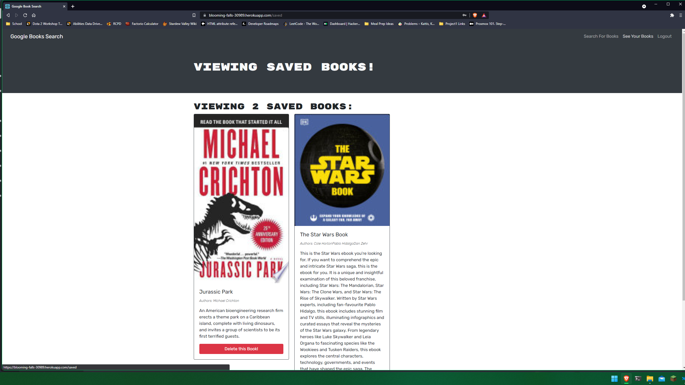
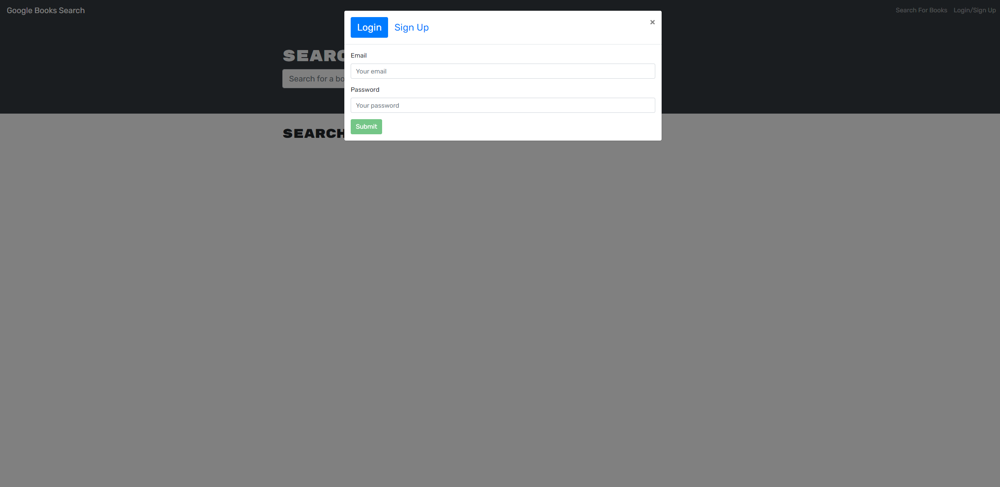

# Book Search Engine

## Description

The book search engine allows you to search google book. If a user signs up for an account they can save books they would like to read, purchase, or are insterested in reading. When a user navigates to their saved books they can see all the books they saved and delete them if they purchase or decide they no longer want them.

The front end is a react app using an Apollo GraphQL Provider that takes advantage of a Apollo Server created in an express backend. This was a refactor project that I refactored the existing REST API to be replaced by a GraphQL API.

## Instructions

Users can start by clicking sign in/up and signup for an account. Once they have an account the user can search for books on the search books page and save them to be viewed later. The user can then go to their saved books page and view their saved books or delete books they no longer wish to have saved.

## Website
### Main Page:

### Login/Signup:

### Saved Books Page:

Deployed Website:
https://blooming-falls-30989.herokuapp.com/
